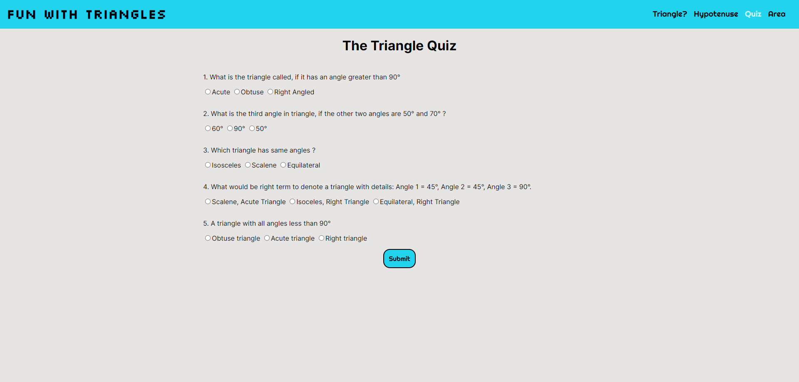

# Fun with Triangles

## mark-12

A webb app built with HTML, CSS and vanilla JS.

The website contains:

* **Triangle Checker:** Taking angles as input and determines whether it is a triangle or not.

* **Hypotenuse Calculator:** Takes base and height as input to calculate hypotenuse of a triangle.

* **Triangle quiz:** A quiz to test, your knowledge on triangles.

* **Area Calculator:** Takes base and height to returns the area of triangle.

Visit the website [here.](https://jagrut-funtriangles.netlify.app/)

